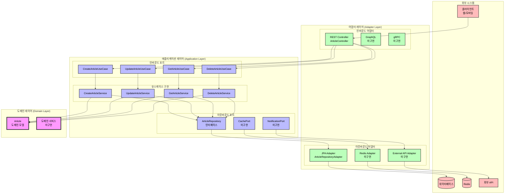
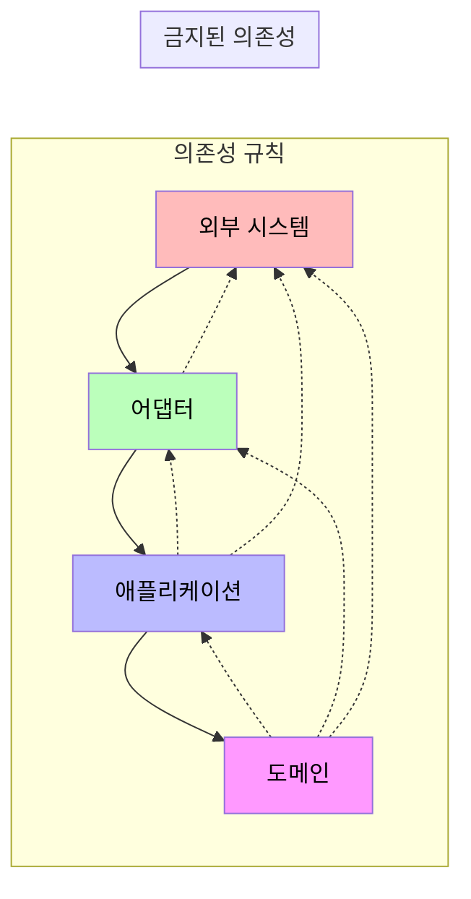
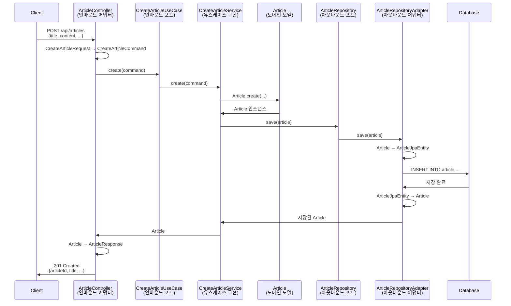

# 헥사고날 아키텍처 다이어그램

## 전체 아키텍처 구조

## 의존성 방향

## 데이터 흐름 예시 (Article 생성)

## 레이어별 책임

### 🎯 도메인 레이어 (Domain Layer)
- **책임**: 핵심 비즈니스 로직
- **특징**: 프레임워크 독립적, 순수 Kotlin/Java
- **예시**: Article 엔티티의 update() 메서드

### 📋 애플리케이션 레이어 (Application Layer)
- **책임**: 유스케이스 조율, 트랜잭션 관리
- **특징**: 비즈니스 프로세스 정의
- **예시**: "게시글 작성" 유스케이스

### 🔌 어댑터 레이어 (Adapter Layer)
- **책임**: 외부 시스템과의 통신
- **특징**: 프레임워크 의존적 (Spring, JPA 등)
- **예시**: REST API, 데이터베이스 연동

## 장점

1. **테스트 용이성**: 각 레이어를 독립적으로 테스트 가능
2. **유연성**: 어댑터만 교체하여 다른 기술 스택으로 전환 가능
3. **비즈니스 로직 보호**: 도메인이 외부 변화에 영향받지 않음
4. **명확한 경계**: 각 레이어의 책임이 명확히 분리됨